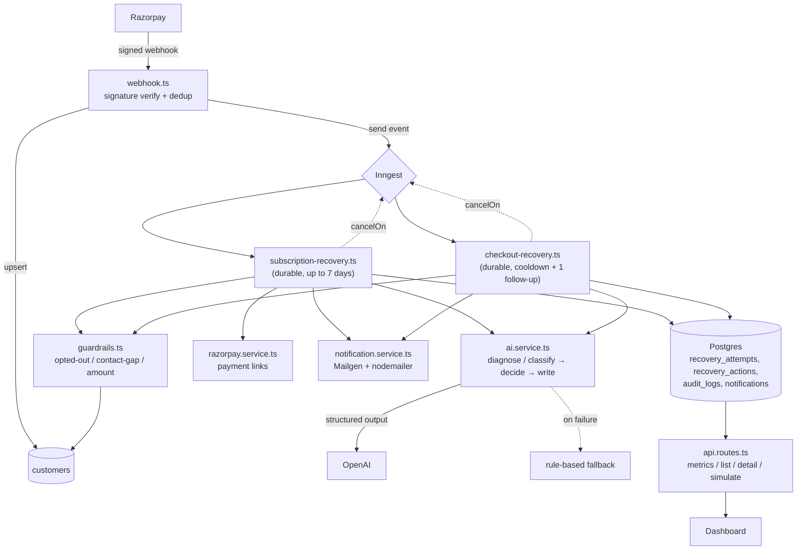

# AI-Powered Payment Recovery Agent

An agent that detects revenue at risk of failed subscription renewals and abandoned checkouts, diagnoses why, and runs a durable, guardrail-bound recovery workflow to win it back.

## The Problem

Revenue loss from failed payments rarely happens in one clean step: a card expires, a bank declines a charge, a customer abandons checkout mid-purchase. Most businesses either do nothing, or blast every failure with the same generic dunning email regardless of why it actually failed or whether the customer has already opted out. Neither approach recovers as much money as it could, and neither leaves an audit trail a compliance reviewer.

## What This Does

- Detects failed subscription payments and abandoned checkouts in real time via signed, deduplicated Razorpay webhooks
- AI diagnoses why a payment failed (soft decline / hard decline / gateway error) and decides the next action not a fixed script
- Runs a durable, multi-day escalation cascade (Day 0 → 1 → 3 → 5 → 7) with hard guardrails: opt-out respect, a minimum gap between contacts, and a minimum-amount threshold
- Separately classifies why a checkout was abandoned and runs a shorter, lighter two-step recovery for it
- Sends real, personalized emails (Mailgen + nodemailer), with SMS as an automatic fallback channel when no email is on file
- Every AI call has a rule-based fallback if OpenAI is unreachable, the workflow degrades to deterministic rules instead of crashing
- Full audit trail of every decision including decisions not to act visible in a live dashboard

## Architecture



**End to end flow:** A Razorpay webhook arrives, gets its signature verified and checked against a table of already-processed webhook IDs, and the customer is looked up or created. Guardrails run before anything else happens an opted-out customer or a below-threshold amount stops the workflow right there, and that decision is still written to the audit trail even though nothing was sent. If it passes, the AI diagnoses the failure and decides the next action; every step it takes or explicitly declines to take is logged, and the whole run can be cancelled instantly if the customer pays through an unrelated channel while it's in progress.

## Tech Stack

- **Runtime:** Bun, TypeScript
- **API:** Hono
- **Workflow engine:** Inngest — durable functions, idempotency, event-based cancellation
- **Database:** PostgreSQL + Drizzle ORM
- **AI:** OpenAI, structured outputs enforced via Zod schemas (model configurable — see `constants.ts`)
- **Payments:** Razorpay (Subscriptions, Payment Links, Orders)
- **Email:** Mailgen + nodemailer over SMTP
- **Frontend:** Next.js + Tailwind + SWR

## Setup

### Prerequisites
- Bun installed
- PostgreSQL running (Docker or local)
- Razorpay Test Mode account with API keys
- OpenAI API key
- SMTP credentials (Mailtrap for dev, Resend for anything closer to production)
- cloudfare/ngrok (or similar) for local webhook testing

### Environment Variables
See `.env.example` for every variable actually read by the codebase.

### Install & Run
```bash
bun install
cd packages/db && bunx drizzle-kit push && cd ../..
npx inngest-cli@latest dev          # terminal 1
cd apps/server && bun run dev       # terminal 2
cd apps/web && bun run dev          # terminal 3
```

### Try It
```bash
curl -X POST http://localhost:8080/api/simulate \
  -H "Content-Type: application/json" \
  -d '{"type": "subscription_soft_decline", "amount": 99900}'
```
Watch it resolve in the dashboard, or follow the Inngest dev server at `http://localhost:8288` to see each step of the cascade run individually.

## Design Decisions

See [`AI_DESIGN.md`](AI_DESIGN.md) for what the AI is trusted to decide versus what's deliberately hard-coded, and [`EDGE_CASES.md`](EDGECASES.md) for the specific failure scenarios this system was tested against — including several that were found and fixed during development, not just designed in from the start.

## What's Not Built

- SMS and WhatsApp sends are simulated and logged to the database; there's no Twilio/WhatsApp Business API integration behind them
- Proactive pre-failure renewal reminders were scoped but not built as of submission.
- Money-recovered figures are a total across every recovered attempt, attributed to a specific logged action per rupee; but there is no holdout/control group proving the AI's intervention caused the recovery rather than the customer paying anyway regardless